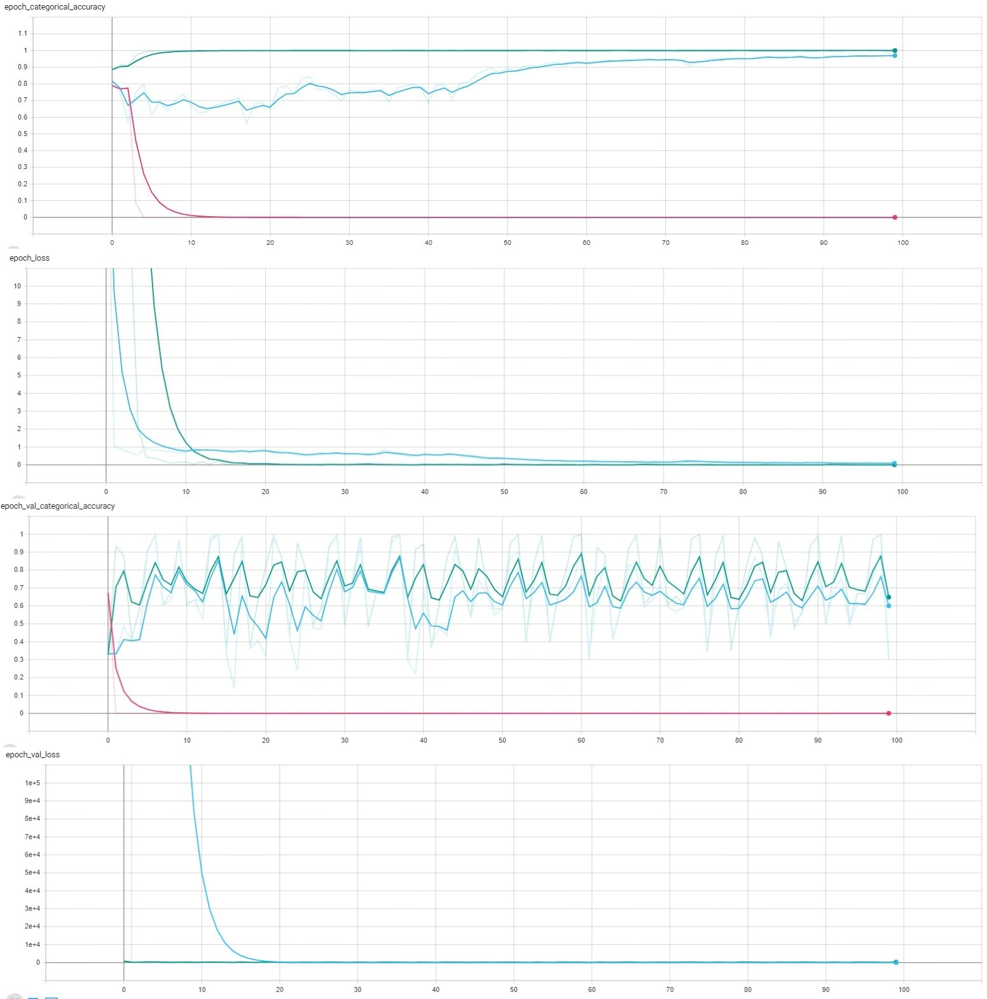
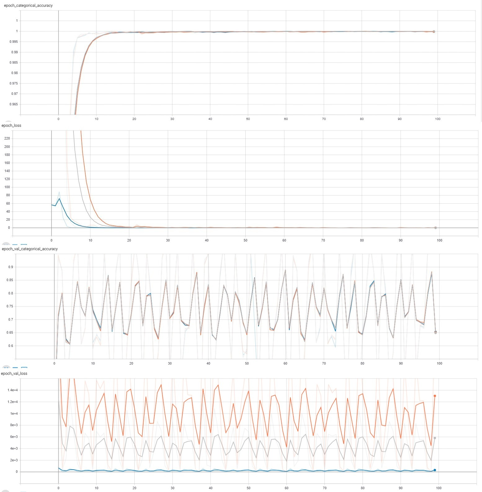
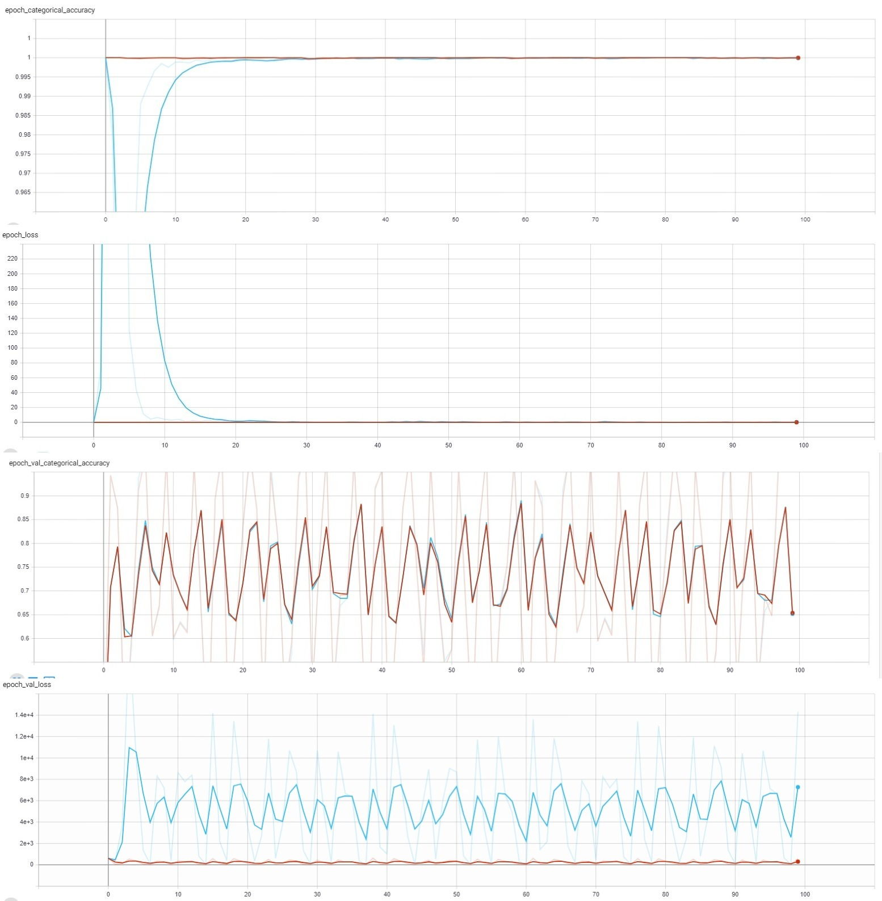

# Lab3
## stage 1
На графиках ниже представлены данные для: оранжевый - lr = 0.001; синий - lr = 0.126; красный - lr = 0.341;

На обучающей выборке оранжевый и красный ведут себя похоже, но ни один не сходится. Синий имеет один пик. Ошибка на обучающей и валидационных выборках у оранжевого не имеет никаких выбросов, следовательно можно сделать вывод, что на этом этапе оптимальный вариант с lr = 0.001.

## stage 2
На графиках ниже представлены данные для: голубой - lr = 0.210; розовый - lr = 0.057; зелёный - lr = 0.310;

На обучающей выборке сходится только зелёный, синий ближе к концу обучения приближается к схождению, но не сходится. На валидационной же выборке синий и зелёный ведут себя похоже, однако у зелёного разброс точности меньше. Ошибка: синит и зелёный имеют пик на старте, после чего сходятся к 0, но синий имеет разброс. Оптимальный вариант - зелёный (lr = 0.310) 

## stage 3
На графиках ниже представлены данные для: серый - lr = 0.005; оранжевый - lr = 0.095; синий - lr = 0.180;

На обучающей выборке все ведут себя похоже, однако серый сходится раньше остальных, а на валидационной выборке имеет больший разброс точности, чем оранжевый и синий. Касаемо ошибок: синий ведёт себя плавнее остальных, не имея больших разбросов около нуля, на обучающей выборке имеет один пик, после чего выбросов больше не проявляет. Остальные два имею по пику, а после в пределах нуля показывают небольшие выбросы.  Оптимальный вариант - lr = 0.180;

## stage 4
На графиках ниже представлены данные для: красный - lr = 0.005; голубой - lr = 0.095; оранжевый - lr = 0.180;

На обучающей выборке красный и оранжевый ведут себя практически одинаково: оба сходятся, имея лишь небольшие колебания. Синий же имеет выброс по точности, после чего стремится к схождению. По ошибкам на обучающей выборке красный и оранжевый не имеют никаких колебаний, голубой опять же имеет выброс. Разброс по точности у всех на вал. выборке практически одинаковый, однако на валидационной ошибке голубой выделяется своими значительными выбросами. Оптимальный вариант - lr = 0.005.

